# FOOD_FINDER(동작구)

동작구 음식점의 카카오맵 리뷰를 감성분석해서 맛집을 자동 추천해주는 시스템

----

## 0. 플로우차트 및 목차

##### 플로우차트 및 기술태그

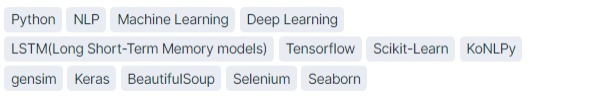

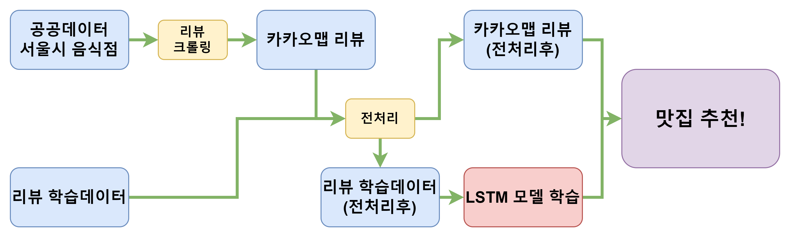

##### 목차

1. [공공데이터 및 학습데이터 다운로드](#1.-공공데이터-및-학습데이터-다운로드)
   - [공공데이터 다운로드](#서울시에-존재하는-모든-음식점-인허가-정보-데이터파일-다운로드)
   - [리뷰 학습데이터 다운로드](#리뷰-감성분석을-위한-학습데이터-다운로드)

2. [공공데이터 전처리](#2.-공공데이터-전처리)
   - [사용할 컬럼만 남기고 나머지 제거](#사용할-컬럼만-남기고-나머지-제거)
   - [결측치 제거](#결측치-제거)
   - [폐업 음식점 제거](#)
   - [동작구 음식점 추출 및 결측치 제거](#)
   - [위도 경도 계산](#XY좌표계를-경도,위도-좌표계로-변경)

3. [카카오맵 음식점 리뷰 크롤링](#3.-카카오맵-음식점-리뷰-크롤링)
   - [리뷰 크롤링](#'자치구+자치동+사업장명'으로-검색하여-리뷰코멘트-주소-크롤링)
   - [결측치 제거](#카카오맵에-존재하지-않는-음식점-제거)
4. [리뷰 학습 데이터로 LSTM 모델 학습](#4.-리뷰-학습-데이터로-LSTM-모델-학습)
   - [리뷰학습데이터 전처리](#리뷰-학습-데이터-전처리)
   - [리뷰학습데이터 형태소 분리](#리뷰-학습-데이터-형태소-분리)
   - [리뷰학습데이터 토큰화 및 토크나이저 저장](#리뷰-학습-데이터-토큰화-및-토크나이저-저장)
   - [리뷰 LSTM학습 및 모델 저장](#리뷰-학습-데이터-LSTM-학습-및-모델-저장)
5. [리뷰 감성분석 및 맛집 추천](#5.-리뷰-감성분석-및-맛집-추천)
   - [동작구 음식점 리뷰 전처리](#동작구-카카오맵-음식점-리뷰-전처리)
   - [LSTM모델로 감성분석](#LSTM모델로-감성분석)
   - [최종 맛집 추천!](#최종-맛집-추천)
6. [참고문헌](6.-참고문헌)

## 1. 공공데이터 및 학습데이터 다운로드

- [서울시 일반음식점 인허가 정보(서울열린데이터광장)](https://data.seoul.go.kr/dataList/OA-16094/S/1/datasetView.do) 
  서울시에 존재하는 모든 음식점 인허가 정보 데이터파일 다운로드

  ```python
  df = pd.read_csv("./src/서울특별시 일반음식점 인허가 정보.csv",
                   encoding='cp949')
  print('공공데이터 크기:',df.shape)
  df.head()
  # 공공데이터 크기: (474939, 44)
  ```

  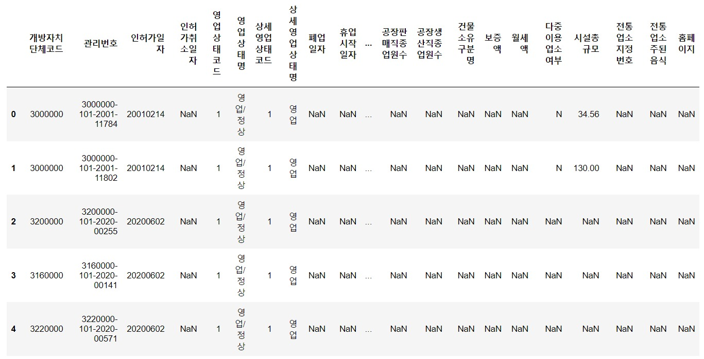

- 리뷰 감성분석을 위한 학습데이터 다운로드

  ```python
  df = pd.read_csv('./src/train.csv')
  print('리뷰 학습 데이터 크기:',df.shape)
  df.head()
  # 리뷰 학습 데이터 크기: (50000, 2)
  ```

  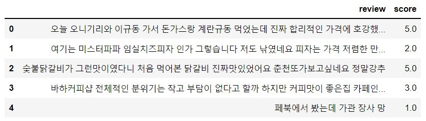

## 2. 공공데이터 전처리

1. 사용할 컬럼만 남기고 나머지 제거

   ```python
   df = df[['상세영업상태코드','도로명주소','사업장명','좌표정보(X)','좌표정보(Y)']]
   df = df.reset_index(drop=True)
   print('공공데이터 크기:',df.shape)
   # 공공데이터 크기: (474939, 5)
   ```

2. 결측치 제거

   ```python
   df = df.dropna()
   df = df.reset_index(drop=True)
   print('공공데이터 크기:',df.shape)
   # 공공데이터 크기: (222827, 5)
   ```

3. '상세영업상태코드' 1: 영업중 2: 폐업 -> 영업중인 음식점만 남기고 '상세영업상태코드' 컬럼 제거

   ```python
   df = df[df["상세영업상태코드"] == 1]
   df = df[['도로명주소','사업장명','좌표정보(X)','좌표정보(Y)']]
   df = df.reset_index(drop=True)
   print('공공데이터 크기:',df.shape)
   # 공공데이터 크기: (121773, 4)
   ```

4. 도로명 주소에서 자치구를 분리한 후, 동작구만 추출

   ```python
   df['자치구'] = [i.split()[1] for i in df['도로명주소']]
   df = df[df['자치구'] == '동작구']
   df = df.reset_index(drop=True)
   print('공공데이터 크기:',df.shape)
   # 공공데이터 크기: (3168, 5)
   ```

5. 도로명 주소에서 자치동을 분리한 후, 결측치 제거

   ```python
   import re
   dong_list = []
   for address in df['도로명주소']:
       try:
           dong = re.findall('사당동|신대방동|흑석동|상도동|상도1동|대방동|노량진동',address)[0]
           if dong == '상도1동':
               dong = '상도동'
           dong_list.append(dong)
       except:
           dong_list.append('error')
   df['자치동'] = dong_list
   df = df[df['자치동'] != 'error']
   df = df[['좌표정보(X)','좌표정보(Y)','자치구','자치동','사업장명']]
   df = df.reset_index(drop=True)
   print('공공데이터 크기:',df.shape)
   # 공공데이터 크기: (3140, 5)
   ```

6. XY좌표계를 경도,위도 좌표계로 변경

   ```python
   import pyproj
   xy = np.array([[df['좌표정보(X)'][i], df['좌표정보(Y)'][i]] for i in range(df.shape[0])])
   def project_array(coord, p1_type, p2_type):
       p1 = pyproj.Proj(init=p1_type)
       p2 = pyproj.Proj(init=p2_type)
       fx, fy = pyproj.transform(p1, p2, coord[:, 0], coord[:, 1])
       return np.dstack([fx, fy])[0]
   p1_type = "epsg:2097"
   p2_type = "epsg:4326"
   result = project_array(xy, p1_type, p2_type)
   df['경도'] = result[:, 0]
   df['위도'] = result[:, 1]
   df = df[['자치구','자치동','사업장명','경도','위도']]
   print('공공데이터 크기:',df.shape)
   df
   # 공공데이터 크기: (3140, 5)
   ```

7. 최종 데이터

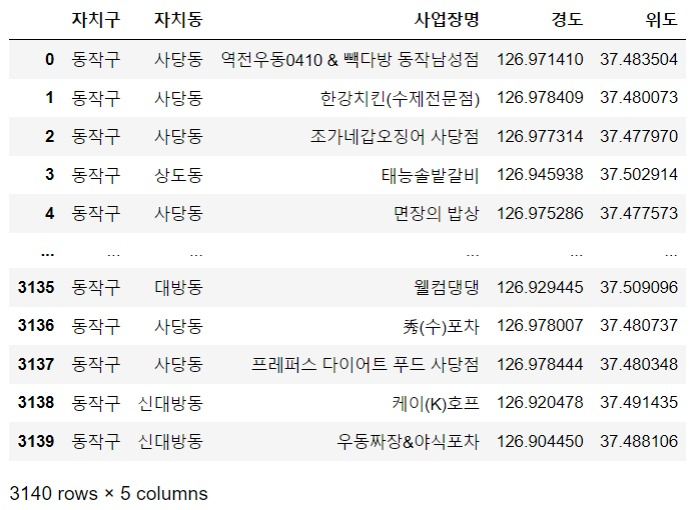

## 3. 카카오맵 음식점 리뷰 크롤링

1. '자치구+자치동+사업장명'으로 검색하여 리뷰코멘트 주소 크롤링

   ```python
   import requests
   import bs4
   from bs4 import BeautifulSoup
   id_list = []
   for i in range(df.shape[0]):
       keyword = df['자치구'][i]+' '+df['자치동'][i]+' '+df['사업장명'][i] 
       url = f'https://search.map.kakao.com/mapsearch/map.daum?callback=jQuery18105963491453995977_1649742498249&q={keyword}&msFlag=A&sort=0'
       header = {
           'user-agent': 'Mozilla/5.0 (Windows NT 10.0; Win64; x64) AppleWebKit/537.36 (KHTML, like Gecko) Chrome/100.0.4896.75 Safari/537.36',
           'referer': 'https://map.kakao.com/'
       }
       response = requests.get(url, headers=header)
       try:
           confirmid = re.findall('confirmid":"([0-9]+)"',response.text)[0]
           review_address = f'https://place.map.kakao.com/{confirmid}'
           id_list.append(review_address)
       except:
           id_list.append('error')
       print(f'\r{i+1}개 진행완료',end='')
   # 3140개 진행완료
   ```

2. 카카오맵에 존재하지 않는 음식점 제거

   ```python
   df['리뷰주소'] = id_list
   df = df[df['리뷰주소'] != 'error']
   df = df.reset_index(drop=True)
   print('공공데이터 크기:',df.shape)
   # 공공데이터 크기: (2637, 6)
   ```

3. 카카오맵 리뷰주소
   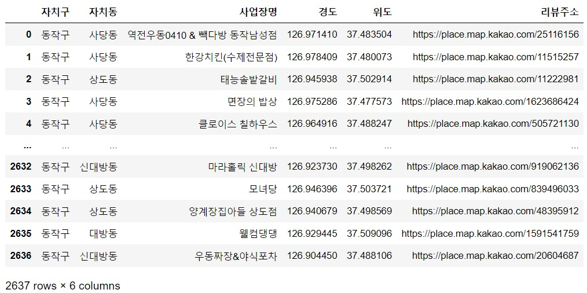
4. 카카오맵 리뷰
   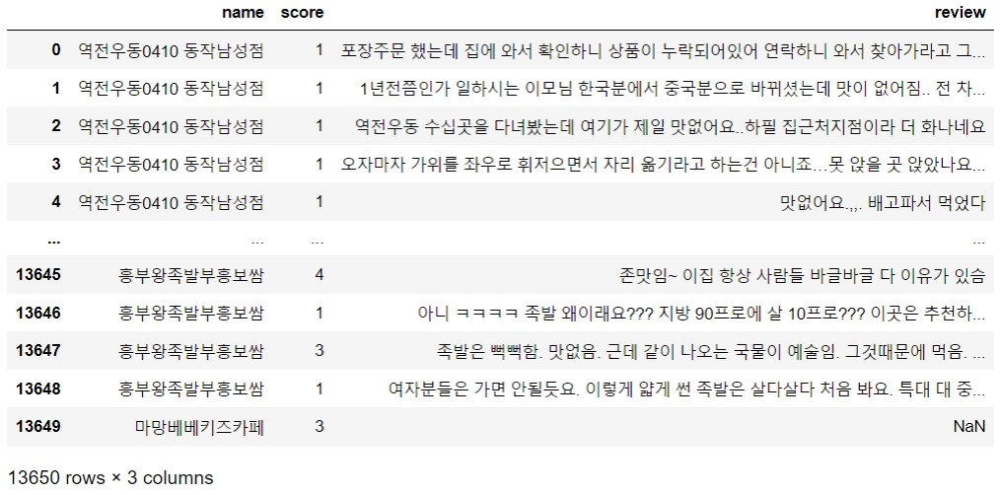

## 4. 리뷰 학습 데이터로 LSTM 모델 학습

1. 리뷰 학습 데이터 전처리

   - 리뷰 학습 데이터 불러오기

     ```python
     df = pd.read_csv('./src/train.csv')
     print('리뷰 학습 데이터 크기:',df.shape)
     # 리뷰 학습 데이터 크기: (50000, 2)
     ```

   - 별점을 1과 0으로 라벨링

     ```python
     def score_evaluate(score):
         if score >= 3.5:
             return 1
         else:
             return 0
     df['score'] = df['score'].apply(score_evaluate)
     ```

   - 한글을 제외한 초성,특수문자,영어 제거

     ```python
     df['review'] = df['review'].str.replace('[^ 가-힣]',' ').str.replace(' +',' ')
     ```

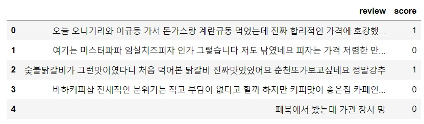

2. 리뷰 학습 데이터 형태소 분리

   - konlpy okt 모듈을 이용해서 형태소 분리

     ```python
     from konlpy.tag import Okt
     
     tag_list = ['Noun','Verb','Adjective','VerbPrefix']
     okt = Okt()
     tokenized_data = []  
     for i in range(df.shape[0]):
         tokenized_sentence = okt.pos(df['review'][i], stem=True) # 토큰화
         tag_checked_sentence = []
         for j in tokenized_sentence:
             x,y = j
             if y in tag_list:
                 tag_checked_sentence.append(x)
         print(f'\r{i+1}개 형태소분석 완료',end='')
         tokenized_data.append(tag_checked_sentence)
     df['토큰화댓글'] = tokenized_data
     # 50000개 형태소분석 완료
     ```

   - 단어 갯수가 3개 이하의 리뷰 제거

     ```python
     df = df[df['토큰화댓글'].str.len() > 3]
     df = df.reset_index(drop=True) 
     print('리뷰 학습 데이터 크기:',df.shape)
     # 리뷰 학습 데이터 크기: (48817, 3)
     ```

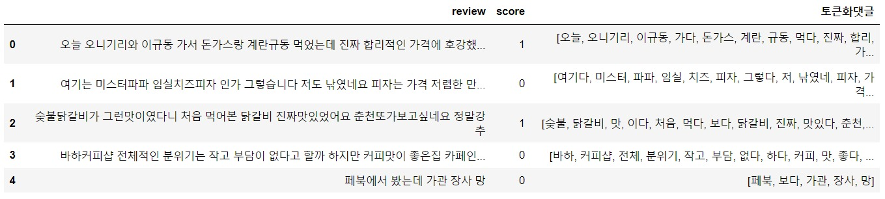

3. 리뷰 학습 데이터 토큰화 및 토크나이저 저장

   - 리뷰 학습 데이터 토큰화

   ```python
   from tensorflow.keras.preprocessing.text import Tokenizer
   
   tokenizer = Tokenizer(num_words=40000, oov_token = True)
   tokenizer.fit_on_texts(df['토큰화댓글'])
   df['토큰'] = tokenizer.texts_to_sequences(df['토큰화댓글'])
   ```

   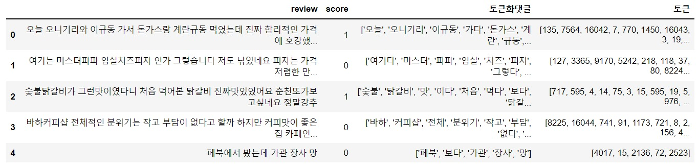

   - 토크나이저 저장

   ``` python
   import pickle
   
   with open('./src/tokenizer.pickle', 'wb') as handle:
           pickle.dump(tokenizer, handle, protocol=pickle.HIGHEST_PROTOCOL)
   ```

4.  리뷰 학습 데이터 LSTM 학습 및 모델 저장

   ```python
   from tensorflow.keras.preprocessing.sequence import pad_sequences
   from tensorflow.keras.models import load_model
   from tensorflow.keras import Sequential
   from tensorflow.keras.layers import Dense, Embedding, LSTM
   from sklearn.preprocessing import LabelEncoder
   
   train = pad_sequences(df['토큰'], maxlen=20)
   label = df['score']
   encoder = LabelEncoder()
   batch_size = label.shape[0]
   input_dim = 1
   label = encoder.fit_transform(label)
   label = np.reshape(label, (batch_size, input_dim))    
   model = Sequential()
   model.add(Embedding(40000, 128))
   model.add(LSTM(128, dropout=0.2, recurrent_dropout=0.2))
   model.add(Dense(1, activation='sigmoid'))
   model.compile(loss='binary_crossentropy', optimizer='adam', metrics=['accuracy'])    
   hist = model.fit(train, label, batch_size=32, epochs=5)
   model.save('./src/model.h5')
   ```

   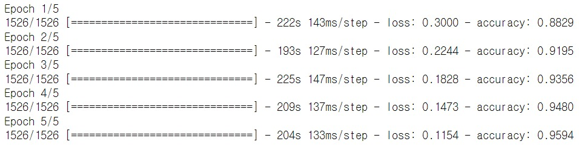

## 5. 리뷰 감성분석 및 맛집 추천

1. 동작구 카카오맵 음식점 리뷰 전처리

   - 동작구 카카오맵 리뷰 데이터 불러오기

   ```python
   test_df = pd.read_csv('./src/dongjack_review.csv')
   test_df = test_df[['name','review']]
   print('리뷰 학습 데이터 크기:',test_df.shape)
   # 리뷰 학습 데이터 크기: (13650, 2)
   ```

   - 리뷰 데이터 한글제외 초성, 특수문자, 영어 제거

   ```python
   test_df['review'] = test_df['review'].str.replace('[^ 가-힣]',' ').str.replace(' +',' ')
   ```

   - 리뷰 데이터 형태소 분리

   ```python
   from konlpy.tag import Okt
   
   tag_list = ['Noun','Verb','Adjective','VerbPrefix']
   okt = Okt()
   tokenized_data = []  
   for i in range(test_df.shape[0]):
       tokenized_sentence = okt.pos(str(test_df['review'][i]), stem=True) # 토큰화
       tag_checked_sentence = []
       for j in tokenized_sentence:
           x,y = j
           if y in tag_list:
               tag_checked_sentence.append(x)
       print(f'\r{i+1}개 형태소분석 완료',end='')
       tokenized_data.append(tag_checked_sentence)
   for i in tokenized_data:
       for j in range(len(i)):
           i[j] = "'"+i[j]+"'"
   test_df['토큰화댓글'] = tokenized_data
   print('리뷰 학습 데이터 크기:',test_df.shape)
   test_df.head()
   # 13650개 형태소분석 완료
   # 리뷰 학습 데이터 크기: (13650, 3)
   ```

   - 리뷰 길이가 3이하의 리뷰 제거

   ```python
   test_df = test_df[test_df['토큰화댓글'].str.len() > 3]
   test_df = test_df.reset_index(drop=True) 
   print('리뷰 학습 데이터 크기:',test_df.shape)
   # 리뷰 학습 데이터 크기: (9662, 3)
   ```

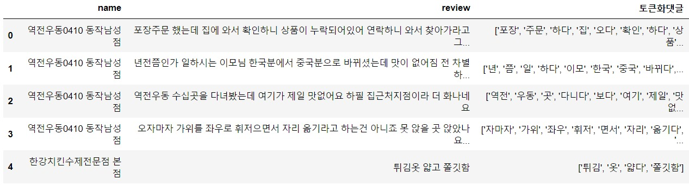

2. LSTM모델로 감성분석

   - 토크나이저 불러오기 및 토큰화

   ```pytho
   import pickle
   
   with open('./src/tokenizer.pickle', 'rb') as handle:
       tokenizer = pickle.load(handle)
   tokenized_data = test_df['토큰화댓글']
   test = tokenizer.texts_to_sequences(tokenized_data)
   test = pad_sequences(test, maxlen=20)
   test
   ```

   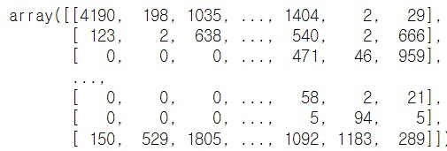

   - 모델 불러오기 및 분석

   ```python
   from tensorflow.keras.models import load_model
   from tensorflow.keras.preprocessing.sequence import pad_sequences
   
   model = load_model('./src/model.h5')
   pred = model.predict(test)
   test_df['score'] = pred
   df = test_df[['name','score']]
   df
   ```

   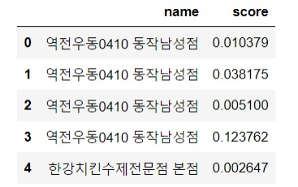

3. 최종 맛집 추천

   - 가게별 리뷰 갯수 및 리뷰 스코어 평균 측정

   ```python
   df = df.groupby('name').agg(review_count=('score', 'size'), score_mean=('score', 'mean')).reset_index()
   print('최종 리뷰데이터 크기:',test_df.shape)
   df.head()
   # 최종 리뷰데이터 크기: (1490, 3)
   ```

   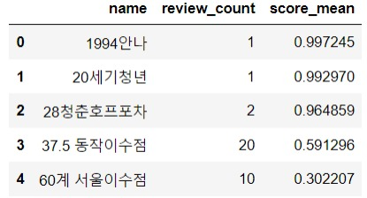

   - 리뷰 갯수가 5개 이상인 가게 및 리뷰스코어 0.9점 이상 내림차순 정렬

   ```python
   df2 = df[df['review_count'] > 4][df['score_mean'] > 0.9].sort_values(by='score_mean',ascending=False).reset_index(drop=True)
   df2
   ```

   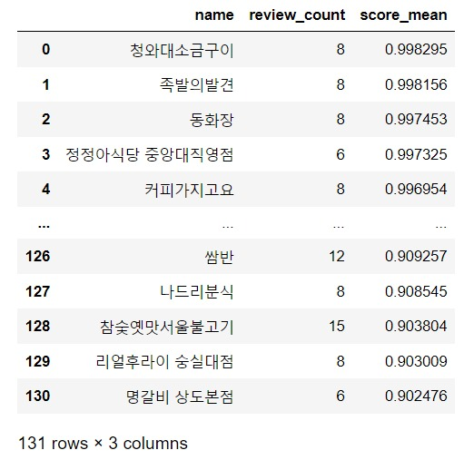

   - 최종 동작구 리뷰 스코어 상위 10개 맛집 리스트!

   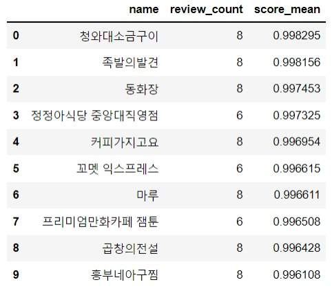

## 6. 참고문헌

- 맛집지도 시각화 - 카카오맵 크롤링 방법 : https://nostalgiaa.tistory.com/36
- 맛집프로젝트 - 카카오맵 크롤링 방법 : https://cordingdoah.tistory.com/97
- 맛집 분석 : https://cottonwood-moa.tistory.com/79
- 구글 api를 사용하여 서울시 맛집리스트 시각화하기 : https://dacon.io/codeshare/2638
- 녹차라떼 맛집 베스트30 크롤링/시각화 : https://velog.io/@hangnii/greenteabest30
- 성북구 음식점 평점 리뷰 크롤링하기 : https://eochodevlog.tistory.com/17
- 음식점 검색 프로그램 (1) : 데이터셋&환경구축 : https://blog.naver.com/kyy0810/221494376698
- 앨라스틱 서치 : https://blog.naver.com/kyy0810/221495323064
- 검색/결과 화면 구성 : https://blog.naver.com/kyy0810/221495979970
- OpenAPI 활용 - 날씨 정보를 사용한 맛집 추천 프로젝트 : https://ai-creator.tistory.com/31
- 강남역 맛집 리뷰 감성 분류 : https://speedanddirection.tistory.com/m/94- https://www.youtube.com/watch?v=KzIc3TDN9JY
- 맛집 리뷰를 통한 감성분석(긍정/부정 언어 판별) : https://moojuksublime.tistory.com/14
- 고객 방문 후기 평정 감성분석 : http://aispiration.com/text/nlp-text-sentiment-yelp.html4. 
- 우리 동네 맛집추천(크롤링과 코사인 유사도) : https://data101.oopy.io/recommendation-engine-cosine-similarity
- 요기요 음식점 크롤링(코드 오류 있음)  : https://scaredev.tistory.com/3
- 카카오 맵 리뷰 크롤링 (깃허브) : https://github.com/wlgh325/python_crawling
- 세미프로젝트 공유 드라이브 : https://drive.google.com/drive/folders/1MeadyLQRxVak7XgxYtBEE6JMIo5WTPwr?usp=sharing
