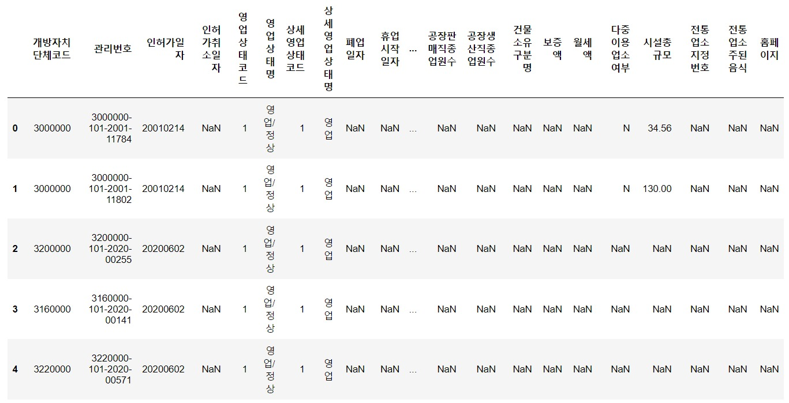
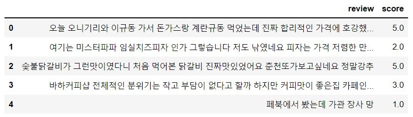

# FOOD_FINDER

음식점 리뷰를 감성분석해서 맛집을 자동 추천해주는 시스템

----

## 1. 데이터

- [서울시 일반음식점 인허가 정보(서울열린데이터광장)](https://data.seoul.go.kr/dataList/OA-16094/S/1/datasetView.do) 
  서울시에 존재하는 모든 음식점 데이터파일 다운로드

  ```python
  df = pd.read_csv("./서울특별시 일반음식점 인허가 정보.csv",
                   encoding='cp949')
  print('공공데이터 크기:',df.shape)
  df.head()
  # 출력
  # 공공데이터 크기: (474939, 44)
  ```

  

- 리뷰 감성분석을 위한 학습데이터 다운로드

  ```python
  df = pd.read_csv('./review_train.csv')
  print('리뷰 학습 데이터 크기:',df.shape)
  df.head()
  # 출력
  # 리뷰 학습 데이터 크기: (50000, 2)
  ```

  


### 세미프로젝트 공유 드라이브

https://drive.google.com/drive/folders/1MeadyLQRxVak7XgxYtBEE6JMIo5WTPwr?usp=sharing

### 참고자료

- 맛집지도 시각화 - 카카오맵 크롤링 방법: https://nostalgiaa.tistory.com/36
- 맛집프로젝트 - 카카오맵 크롤링 방법https://cordingdoah.tistory.com/97
- 맛집 분석https://cottonwood-moa.tistory.com/79
- 구글 api를 사용하여 서울시 맛집리스트 시각화하기https://dacon.io/codeshare/2638
- 녹차라떼 맛집 베스트30 크롤링/시각화https://velog.io/@hangnii/greenteabest30
- 성북구 음식점 평점 리뷰 크롤링하기https://eochodevlog.tistory.com/17
- 음식점 검색 프로그램 (1) : 데이터셋&환경구축https://blog.naver.com/kyy0810/221494376698
- 앨라스틱 서치https://blog.naver.com/kyy0810/221495323064
- 검색/결과 화면 구성https://blog.naver.com/kyy0810/221495979970
- OpenAPI 활용 - 날씨 정보를 사용한 맛집 추천 프로젝트https://ai-creator.tistory.com/31
- 강남역 맛집 리뷰 감성 분류- https://speedanddirection.tistory.com/m/94- https://www.youtube.com/watch?v=KzIc3TDN9JY
- 맛집 리뷰를 통한 감성분석(긍정/부정 언어 판별)- https://moojuksublime.tistory.com/14
- 고객 방문 후기 평정 감성분석- http://aispiration.com/text/nlp-text-sentiment-yelp.html4. 
- 우리 동네 맛집추천(크롤링과 코사인 유사도)- https://data101.oopy.io/recommendation-engine-cosine-similarity
- 요기요 음식점 크롤링(코드 오류 있음)https://scaredev.tistory.com/3
- 카카오 맵 리뷰 크롤링 (깃허브)https://github.com/wlgh325/python_crawling
